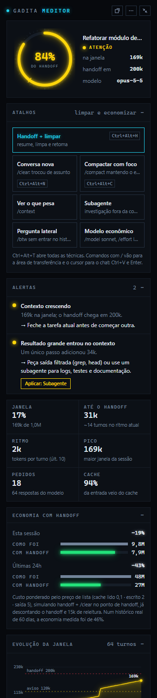
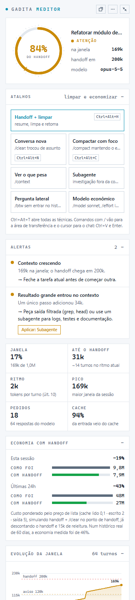

<div align="center">


# Gadita Meditor

**Veja a janela de contexto do Claude Code em tempo real, receba alertas baseados nas boas práticas da Anthropic e gaste menos tokens.**

[](https://github.com/rodrigogadita/gadita-meditor/releases/latest)
[](LICENSE)
[](https://code.visualstudio.com)

[Baixar a extensão](https://github.com/rodrigogadita/gadita-meditor/releases/latest) · [Técnicas](#técnicas-que-economizam-de-verdade)


&nbsp;&nbsp;


</div>

---

## Por que existe

O Claude Code reenvia **toda a conversa** a cada mensagem. Uma sessão que cresce para 300k, 500k ou 1M tokens paga esse histórico de novo a cada pergunta, e a própria Anthropic avisa que **a qualidade cai conforme a janela enche**.

A barra de status do terminal mostra isso, mas **não aparece na extensão do Claude Code para VS Code**. O Gadita Meditor preenche essa lacuna: lê os registros locais das sessões e mostra, dentro do VS Code, quanto da janela você está usando e o que fazer a respeito.

## O que faz

| | |
|---|---|
| **Barra de status** | `169k · 84%` (tokens na janela e % do ponto de handoff), em verde, amarelo ou vermelho, com o número de alertas ativos. |
| **Anel de handoff** | 100% = hora de fazer handoff e limpar. A marca amarela é o aviso. |
| **Alertas** | 10 sinais de desperdício tirados da documentação oficial da Anthropic (tabela abaixo). |
| **Economia estimada** | Quanto a sessão atual e as últimas 24h custariam com handoff no ponto certo. |
| **Evolução da janela** | Tokens por turno, linhas de aviso e handoff, compactações marcadas. |
| **Sessões do dia** | Todas as conversas das últimas 24h; clique para acompanhar outra. |
| **Onde você quiser** | Barra lateral, lateral direita, aba do editor ou **janela flutuante sempre por cima**. |
| **Modo encolhido** | Só o anel e o número, para deixar num canto da tela. |


## Instalar

### Opção 1: arquivo .vsix (recomendado)

1. Baixe o `gadita-meditor-x.y.z.vsix` na [página de versões](https://github.com/rodrigogadita/gadita-meditor/releases/latest).
2. No VS Code: `Ctrl+Shift+P` › **Extensions: Install from VSIX...** › escolha o arquivo.

Ou pelo terminal:

```bash
code --install-extension gadita-meditor-3.1.0.vsix
```

### Opção 2: a partir do código

```bash
git clone https://github.com/rodrigogadita/gadita-meditor.git
cd gadita-meditor
npx @vscode/vsce package
code --install-extension gadita-meditor-*.vsix
```

Requisitos: VS Code 1.90+ e o Claude Code já usado nesta máquina (a extensão lê `~/.claude/projects`).

## Usar

| Ação | Como |
|---|---|
| Abrir o menu (flutuante, aba, lateral, técnicas) | Clique na barra de status ou no botão `⋯` do painel |
| Janela flutuante | `Ctrl+Alt+G` (`Cmd+Alt+G` no Mac) ou botão `⧉` |
| Fixar à direita | Arraste o ícone do Gadita para a barra lateral secundária |
| Encolher / expandir | Botão `⤡` no topo do painel |
| Abrir sozinho ao iniciar | Configuração `gaditaMeditor.abrirAoIniciar` = `flutuante` ou `aba` |

A janela flutuante usa as janelas auxiliares do VS Code (solta, compacta e sempre por cima). A aba volta sozinha quando você recarrega o VS Code.

## Atalhos que aplicam as técnicas

| Atalho | Técnica | O que acontece |
|---|---|---|
| `Ctrl+Alt+H` | **Handoff + limpar** | Prepara o `/handoff` no chat; quando o Claude salva o handoff e termina a resposta, abre sozinho uma conversa nova, que já retoma de onde parou |
| `Ctrl+Alt+N` | **Conversa nova** | Equivale ao `/clear`: abre uma conversa limpa (a anterior continua salva) |
| `Ctrl+Alt+C` | **Compactar com foco** | Pergunta o que deve sobreviver e monta o `/compact <foco>` |
| `Ctrl+Alt+T` | **Todas as técnicas** | Menu com as anteriores e mais: `/context`, subagente, `/btw`, modelo econômico |
| `Ctrl+Alt+G` | Janela flutuante | Painel solto e sempre por cima |

Os mesmos atalhos aparecem como botões no painel, e cada alerta tem um botão **Aplicar** com a técnica que o resolve (por exemplo, "Hora do handoff" › Handoff + limpar).

Como funciona: a conversa nova usa o comando da própria extensão do Claude Code (`claude-vscode.newConversation`). Nenhuma extensão pode digitar no chat do Claude, então os comandos com `/` vão para a área de transferência e o cursor vai para a caixa de mensagem: é só `Ctrl+V` e `Enter`. No Mac, troque `Ctrl` por `Cmd`.

## Alertas

Cada alerta vem de uma recomendação oficial ([Manage costs](https://code.claude.com/docs/en/costs) e [Best practices](https://code.claude.com/docs/en/best-practices)).

| Cor | Alerta | Quando dispara | O que fazer |
|---|---|---|---|
| 🔴 | Hora do handoff | Janela no ponto de handoff (200k por padrão) | Handoff + `/clear` |
| 🔴🟡 | Cache expirado | Mais de 1h parado com contexto grande: a próxima mensagem reprocessa tudo | `/clear` se mudou de assunto; `/handoff` se é a mesma tarefa |
| 🟡 | Contexto crescendo | Passou do aviso (120k) | Feche a tarefa antes de abrir outra |
| 🟡 | Cache perdido | Turnos que reescreveram muito cache na última hora | Evite pausas e troca de modelo no meio da tarefa |
| 🟡 | Resultado grande | Um único passo adicionou mais de 25k | Saída filtrada (`grep`, `head`) ou subagente |
| 🟡 | Correções repetidas | 2 dos últimos 4 pedidos parecem correções | `/clear` e um pedido melhor |
| 🟡 | Sessão longa | Mais de 4h e 20 pedidos na mesma conversa | `/clear` entre tarefas; `/rename` antes |
| 🟡 | Compactação é cara | A sessão já compactou (compactar lê a conversa inteira) | Prefira handoff + `/clear` |
| 🟡 | Começo pesado | A sessão já abre com mais de 40k | `/context`, desligar MCP sem uso, CLAUDE.md curto |
| 🟡 | Exploração longa | 15+ leituras e buscas desde o último pedido | Delimitar escopo ou usar subagente |
| 🟢 | Tarefas simples no Opus | Respostas muito curtas no Opus | `/model sonnet` ou `/effort` menor |

"Correções repetidas" e "Tarefas simples no Opus" são estimativas por palavras e tamanho de resposta: servem de lembrete, não de medição.

## Kit de handoff (opcional)

A extensão **mostra** o problema. O kit **resolve** a parte chata: no ponto ideal, o próprio Claude escreve um resumo para continuar depois, e esse resumo volta sozinho na sessão nova.

```bash
python kit/instalar.py            # instala
python kit/instalar.py --remover  # desfaz
```

O instalador faz backup do seu `~/.claude/settings.json` e **acrescenta** (sem apagar nada seu):

1. **Hook ao enviar pedido:** quando a janela chega ao ponto de handoff, pede ao Claude para terminar a tarefa, gravar o handoff em `~/.claude/handoffs/` e avisar você.
2. **Skill `/handoff`:** formato curto (objetivo, estado, decisões, arquivos, próximo passo, armadilhas).
3. **Hook ao iniciar sessão:** depois do `/clear`, injeta o handoff da mesma pasta na conversa nova.
4. **Barra de status no terminal**, se você ainda não tiver uma.

Fluxo: o alerta fica vermelho › o Claude grava o handoff › você digita `/clear` › a sessão nova já começa sabendo onde parou.

> Nenhum hook consegue executar `/clear` por você. Esse é o único passo manual.

Limites em `~/.claude/context-guard/config.py`: aviso em 40% da janela ou 120k, handoff em 60% ou 200k (vale o que vier primeiro).

## Técnicas que economizam de verdade

Em ordem de impacto, com base na documentação da Anthropic e medição real:

1. **`/clear` entre tarefas, com handoff.** O maior ganho. Contexto velho é reenviado em toda mensagem e piora as respostas.
2. **Pedido específico e verificável.** Arquivo, função e critério de pronto. Pedido vago dispara leitura ampla, e retrabalho custa mais que qualquer configuração.
3. **Duas correções sem sucesso? Recomece.** Uma sessão limpa com um pedido melhor quase sempre supera uma longa cheia de tentativas.
4. **Subagente para volume.** Logs, testes e documentação ficam no contexto do subagente; só o resumo volta.
5. **Modelo sob medida.** Sonnet para a maior parte do código, Opus para arquitetura e raciocínio longo, `/effort` menor no simples.
6. **Não pare no meio da tarefa.** Depois de 1h sem uso (assinatura) o cache expira e a próxima mensagem reprocessa tudo.
7. **Base enxuta.** CLAUDE.md abaixo de 200 linhas, MCP sem uso desligado, instruções raras em skills.

## Quanto economiza

Medido num histórico real de **60 dias, 46 sessões e 9.767 respostas**:

| | Como foi | Handoff em 200k |
|---|---|---|
| Respostas com mais de 200k na janela | 75% | 0% |
| Tokens processados | 4,2 bilhões | 1,2 bilhão (**−72%**) |
| Custo ponderado | 100% | **54% (−46%)** |

Em cenários pessimistas (handoff mais tarde, muita releitura após o `/clear`) a economia ficou entre **40% e 46%**. Fazer o handoff mais cedo (120k) **não** economizou mais: os recomeços passam a custar.

**Meça o seu:**

```bash
python ferramentas/economia.py                     # handoff em 200k, últimos 60 dias
python ferramentas/economia.py --handoff 150000 --dias 30
```

Método: refaz cada sessão turno a turno e simula o recomeço no ponto de handoff, com pesos do preço de lista (leitura de cache 0,1 · escrita 2 · saída 5, entrada = 1). O custo do recomeço está incluído (gerar o handoff, refazer o cache, reler arquivos). O custo das compactações evitadas não está, então o número real tende a ser um pouco maior.

**Limites honestos:** é uma simulação. Numa tarefa longa e complexa, um handoff pode perder nuance; às vezes vale deixar o contexto crescer. Os limites de assinatura seguem o volume de contexto, mas a proporção exata não é pública.

## Configurações

| Chave | Padrão | O que faz |
|---|---|---|
| `gaditaMeditor.janela` | `0` | Tamanho da janela. `0` = automático (1M se a conta já passou de 200k, senão 200k) |
| `gaditaMeditor.abrirAoIniciar` | `nada` | `flutuante` ou `aba` para abrir sozinho |
| `gaditaMeditor.notificar` | `true` | Notificação nos alertas vermelhos |
| `gaditaMeditor.limparAposHandoff` | `true` | No Handoff + limpar, abrir a conversa nova sozinho (ou perguntar antes, se `false`) |

## Privacidade

Tudo roda na sua máquina. A extensão **só lê** `~/.claude/projects/*.jsonl` (os registros que o próprio Claude Code grava) e, se o kit estiver instalado, escreve um arquivo de estado em `~/.claude/context-guard/state/`. Nada é enviado para lugar nenhum.

## Desenvolvimento

```
extension.js          leitura incremental, alertas, simulação, barra de status, janelas
media/painel.*        interface (HTML, CSS, JS sem dependências)
kit/                  hooks, skill de handoff e instalador
ferramentas/          economia.py (medição) e previa.js (prévias com dados fictícios)
docs/img/             imagens do README
```

Sem dependências de runtime. Para testar mudanças visuais: `node ferramentas/previa.js` e abra `docs/previa-escuro.html` no navegador.

## Licença

[MIT](LICENSE) © Rodrigo Silva
